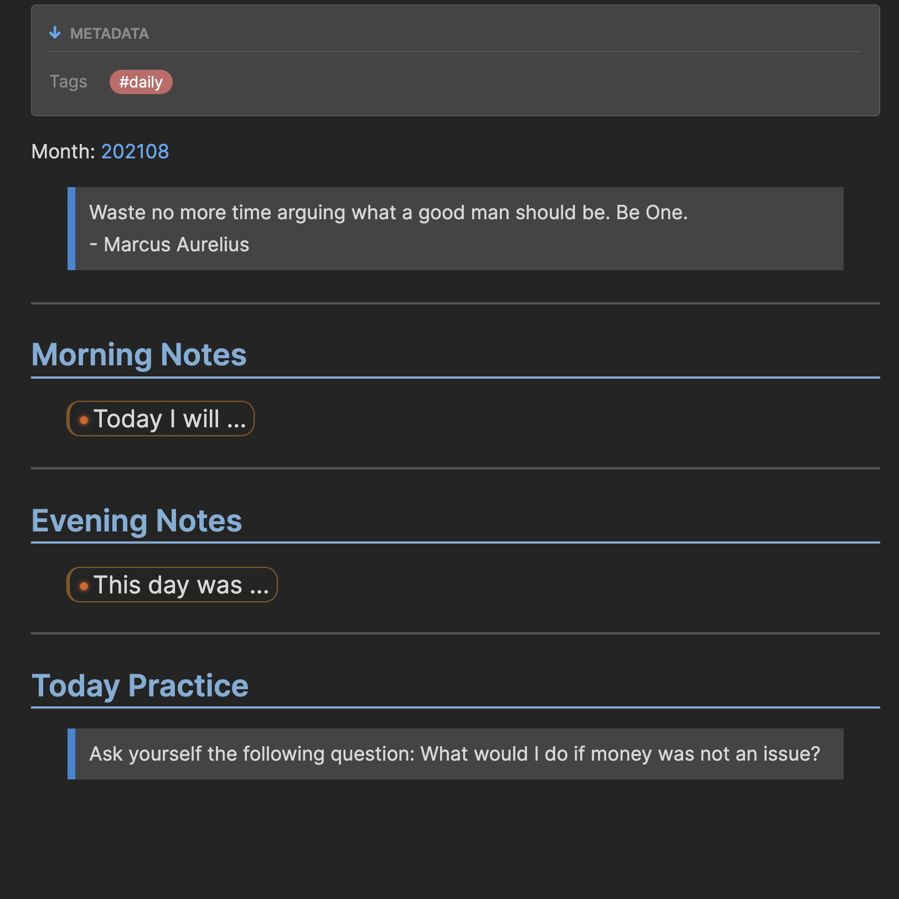

# Stoic Daily Plugin

The plugin creates a daily note for **morning and evening reflection** accompanied by the **quote of the day** and **practice**.

## How o use
- `Ctrl + s` to open daily note
- You can change the display of components in the settings

## Generated note example

## API Documentation
See https://github.com/obsidianmd/obsidian-api
