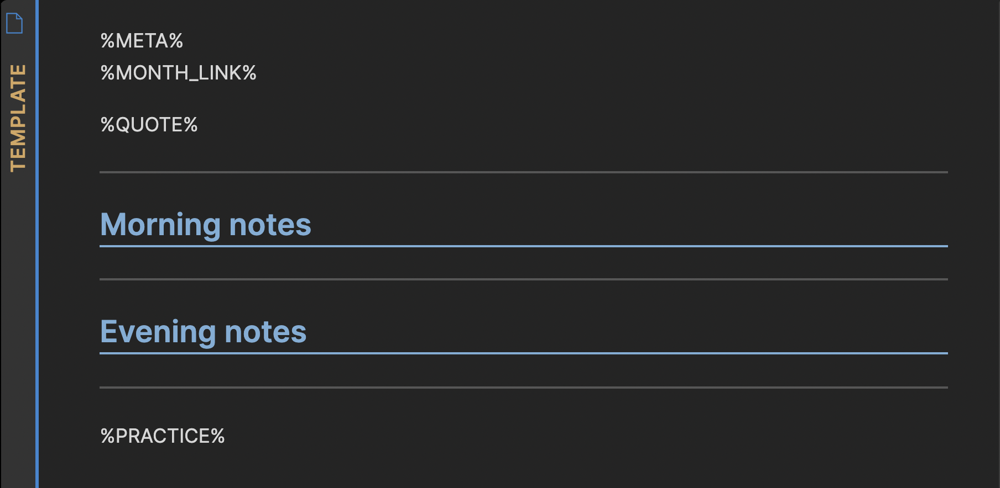
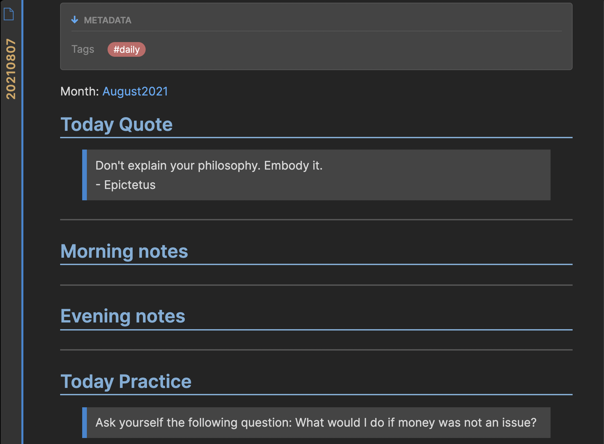

# Stoic Daily Plugin

### The plugin creates a daily note for **Morning and evening reflection** accompanied by the **quote of the day** and **practice**.

## How o use
- Edit the template `stoic-daily/TEMPLATE.md`
- Press `Ctrl + s` to open daily note

### List of available commands
- `%META%` - adds meta information 
- `%MONTH_LINK%` - adds the link to the month note
- `%QUOTE%` - adds a stoic quote
- `%PRACTICE%` - adds a stoic practice

## Template for generating notes

## Generated note example

## API Documentation
See https://github.com/obsidianmd/obsidian-api